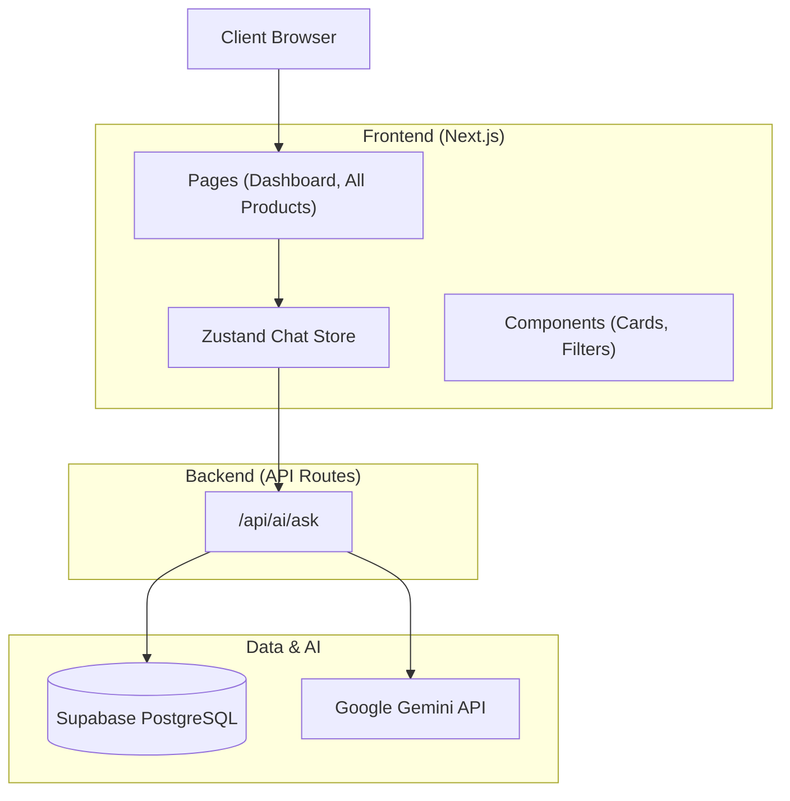

# Loan Picks Dashboard

A Next.js web application for personalized loan discovery and AI-assisted Q&A.

## 🚀 Features
- **Dashboard**: Top 5 personalized loan picks.
- **Best Match**: Highlighted top recommendation.
- **All Products**: Search and Filter loans by Bank, APR, Income, and Credit Score.
- **AI Chat**: "Ask About Product" feature powered by **Google Gemini**.

## 🛠 Tech Stack
- **Framework**: Next.js 14+ (App Router)
- **Language**: TypeScript
- **UI**: Shadcn/ui + Tailwind CSS
- **Database**: PostgreSQL (Supabase) + Prisma
- **State**: Zustand (for Chat)
- **AI**: Google Gemini (via `@google/generative-ai`)

## 🏗 Architecture


## ⚡ Setup Instructions

### 1. Install Dependencies
```bash
npm install
```

### 2. Configure Environment
Copy `.env.example` to `.env` and fill in your keys:
```env
DATABASE_URL="postgresql://..."
DIRECT_URL="postgresql://..."
GOOGLE_API_KEY="AIzaSy..."
```

### 3. Database Setup
Ensure your schema is up to date and seeded with sample data:
```bash
npx prisma db push
npx prisma db seed
```
*Note: The app requires a connected database to function correctly.*

### 4. Run Locally
```bash
npm run dev
```
Open [http://localhost:3000](http://localhost:3000).

## 🛡 Badge Logic
Dynamic badges are assigned to products based on attributes:
- **Low APR**: APR < 11%
- **Fast Disbursal**: "Instant" or contains "hour"
- **No Prepayment Penalty**: `prepayment_allowed` is true.
- **Low Docs**: `docs_level` === 'minimal'

## 🤖 AI Grounding Strategy
The AI Chat uses a **Retrieval-Augmented Generation (RAG)-lite** approach:
1. When user asks a question, the backend fetches the **specific product context** (mock or DB).
2. A strictly scoped **System Prompt** is constructed containing *only* that product's details.
3. The LLM is instructed to answer *only* based on the provided context.
